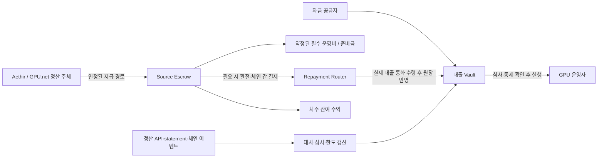

# GPU Lending Pivot — Aethir / GPU.net

작성일: 2026-09-14 · 코드 기준: `c1f839a` 및 현재 작업 트리 · 상태: 설계/실행 계획, 구현 전

이 문서는 현재 Rackline v1(HashCredit) 코드와 공개된 공식 자료를 검토하여 GPU 렌딩으로 전환하기 위한 제품, 파트너, 집행, 회계, 구현, 운영 과제를 정리한다. 공개 문서 확인은 실제 파트너 계약이나 API 접근권 확보를 의미하지 않는다. 아래의 새 컨트랙트·API 이름은 설계 제안이다.

## 1. 피벗의 결론과 제품 정의

권장 방향은 **Aethir·GPU.net에 GPU를 공급하는 운영자에게, 통제 가능한 GPU 매출채권과 정산 수익을 기반으로 스테이블코인 운영자금을 대출하는 서비스**다. 첫 상품은 검증된 기존 운영자의 단기 매출채권 금융으로 좁힌다. 장비 구매금융은 실물 담보권과 데이터센터의 협조를 확보한 다음 확장한다.

여기서 렌딩은 GPU 공급자에게 자금을 빌려주는 것으로 해석한다. GPU 자체를 사용자에게 빌려주는 임대 마켓플레이스, GPU를 사용하는 고객의 후불 결제, ATH/$GPU 토큰 담보대출은 차주·회수 수단·제품 구조가 다른 별도 상품이다.

이번 피벗의 성립 조건은 GPU라는 자산 명칭이 아니라 **차주의 추가 동의 없이 계약된 상환금을 회수할 수 있는가**다. GPU도 운영자가 전원을 끄거나 다른 네트워크로 이동할 수 있다. Aethir·GPU.net에 연결했다는 사실만으로 우리에게 장비 처분권이나 수익금 통제권이 생기지 않는다.

핵심 결정은 다음과 같다.

- 대출 실행 전에 지급 통제 권한, 철회 제한, 회수 경로를 실제로 검증한다. 읽기 전용 API와 매출 대시보드만 연결된 계정에는 대출하지 않는다.
- 1차 회수 재원은 확정된 매출채권과 통제 계좌로 들어오는 정산금이다. 실물 GPU는 별도로 담보권·보관·처분 권한을 확보한 경우에만 담보가치에 포함한다.
- Aethir와 GPU.net은 서로 다른 어댑터와 리스크 정책을 갖는다. 공통 스키마는 만들되 첫 실제 대출은 집행 검증을 먼저 통과한 한 파트너에서 시작한다.
- 현재 검증 어댑터 분리, 지갑 연동, 대출 UX, 테스트 기반은 활용한다. BTC 단위의 데이터 모델과 현재 대출 회계는 재설계한다.
- Creditcoin을 유지하는 방향을 우선 검토하되, 실제 스테이블코인 조달·회수와 소스 체인 연결을 출시 전 조건으로 둔다.

첫 출시의 성공 기준은 “GPU 지표로 한도가 표시됨”이 아니라 **차주가 상환 버튼을 누르지 않아도 실제 정산금이 들어와 원리금이 정확히 줄고, 차주의 지급 경로 우회가 차단됨**이다.

## 2. 현재 프로젝트 상세 리뷰

### 2.1 현재 구현과 재사용 경계

현재 시스템의 중심은 `Bitcoin payout → proof → trailing revenue → credit limit → borrow/repay`다. GPU 자산 원장, 지급 통제, 매출채권 양도, 자동 회수, 만기·연체·부실 처리는 구현되어 있지 않다.

| 영역 | 실제 구현 | 피벗 판단 |
| --- | --- | --- |
| 신용 관리 | `HashCreditManager`: 차주 등록, BTC 지급 기록, 한도, 차입·상환 | 책임 분리는 활용; 차주·시설·대출별 원장과 상태 전환 재작성 |
| 유동성 | `LendingVault`: 자체 LP share 원장, 대출 원금 총액, 고정 차입 APR | 토큰 전송 패턴 활용; 회계·손실·출금 정책 재설계. ERC-4626 표준 구현으로 간주하지 않음 |
| 검증 경계 | `IVerifierAdapter`로 증거 검증 분리 | 패턴 유지; `PayoutEvidence`는 BTC 전용이므로 ABI 교체 |
| BTC 검증 | SPV, checkpoint, BTC 서명·주소 귀속 | GPU 활성 경로에서 제외, 레거시 기록/테스트로 보존 |
| 리스크 | BTC 가격, sats, 30일 지급 합계, 횟수·금액 휴리스틱 | GPU 순현금흐름, 매출채권 만기, 통제 상태, 노출 한도로 교체 |
| 소스 등록 | `PoolRegistry` allowlist/permissive 모드 | 실제 지급 주체·정산 계약·권한을 검증하는 ProviderRegistry로 대체 |
| API | FastAPI proof/claim/read + 관리자 키로 등록·신용 부여하는 경로 | GPU 계정 연동·심사·정산 API로 개편, 서명 권한 분리 |
| worker | BTC 주소 감시, proof 생성/전송, 중복 관리 | 재시도·상태 저장 패턴 활용; 공급자 수집·대사·회수 worker 신설 |
| 프런트엔드 | React/ethers/Zustand, Dashboard·Pool 중심 | 공통 UI·지갑 연결 유지, BTC onboarding 및 고정 지표 교체 |
| 인프라/검증 | Foundry, Python tests, Docker/Railway, GitHub Actions | 유지·확장; 파트너 sandbox, 회계 불변식, 프런트엔드 CI 추가 |

### 2.2 피벗 전에 처리할 코드상 문제

아래 P0는 실제 자금 취급 전 필수, P1은 파일럿의 정상 운영 전 필수다. 이는 코드 검토 결과이며 배포된 서비스가 현재 공격받고 있다는 의미는 아니다.

| 우선순위 | 발견 및 근거 | GPU 피벗에서의 조치 |
| --- | --- | --- |
| P0 | README의 원천징수·hashrate redirect 설명에 대응하는 escrow/default/recovery 구현이 없음. `contracts/HashCreditManager.sol:398`의 상환은 호출자 토큰을 가져오는 자발적 상환 | 파트너 지급 통제 계약 + source escrow + 제3자 상환 경로를 핵심 기능으로 구현 |
| P0 | 일부 이자만 내도 `lastDebtUpdateTimestamp`를 갱신하고 미납 이자를 보존하지 않음 (`HashCreditManager.sol:415`, `:435`) | 미납 이자 원장 보존. 원금/미수이자/연체이자 정의 및 회계 단일화 |
| P0 | Manager는 이자 우선, Vault는 전체 차주 원금 총액부터 상환 처리 (`HashCreditManager.sol:411`, `LendingVault.sol:216`) | 확정된 principal/interest/fee 배분을 한 원장에서 계산하고 Vault와 동일하게 반영 |
| P0 | 재차입 때 Manager만 이자를 부채에 자본화 (`HashCreditManager.sol:371`, `:385`), Vault는 추가 송금액만 원금에 더함 (`LendingVault.sol:197`) | 자본화 여부를 상품 약정으로 고정하고 차주·facility·Vault 합계를 일치시킴 |
| P0 | 차주는 마지막 활동 이후 전체 기간에 현재 APR을 적용 (`HashCreditManager.sol:533`), Vault는 APR 변경 전에 과거 이자 확정 (`LendingVault.sol:124`) | 기간별 금리 checkpoint/index 또는 facility별 고정금리로 과거 이자 재산정 방지 |
| P0 | 공개 `/claim/register-and-grant`가 인증/claim 검증 없이 설정된 관리자 키로 차주 등록·신용 부여 (`offchain/api/hashcredit_api/main.py:517`) | 운영 API에서 제거. 데모 전용 서비스·키·체인 격리, 승인 작업은 권한 검사·감사 기록 필수 |
| P0 | `grantTestnetCredit`/auto grant에 온체인 testnet 제한이 없고, `DeploySpv.s.sol:113`은 외부 stablecoin 사용 시에도 auto grant 설정 | production artifact에서 데모 권한 제거. 배포 전 chain/asset/cap/owner 검증 |
| P0 | BTC claim이 전달받은 hash의 서명만 검사하고 caller/domain/nonce/기한을 직접 결합하지 않음 (`BtcSpvVerifier.sol:176`) | BTC 경로 폐기 시에도 같은 패턴 복사 금지. provider 계정·차주·체인·컨트랙트·nonce·만료 시각을 서명에 결합 |
| P1 | 한도 갱신은 새 지급 제출 때만 수행하고 차입은 저장된 한도 사용 (`HashCreditManager.sol:325`, `:374`). 오래된 지급은 제출 시각으로 기록 (`:323`) | 발생/확정/수집 시각 분리, 차입 순간 만료·한도·통제 상태 재검증 |
| P1 | PoolRegistry에 지급 주체 대신 txid 전달 (`HashCreditManager.sol:300`); strict 모드 전환만으로 매출 출처를 증명하지 못함 | provider/account/payer/settlement provenance 검증. 자기 송금, 보조금, 차입금 입금은 영업매출과 분리 |
| P1 | `repay()`가 `whenNotPaused`여서 비상 정지 중 회수도 차단 (`HashCreditManager.sol:398`), `repayFor` 없음 | 차입 중단과 회수 경로 정지 분리, escrow/keeper/제3자 상환 지원 |
| P1 | Vault NAV가 부실 원금·미수이자를 계속 자산으로 계산 (`LendingVault.sol:241`), 부실 상각·회수 손익·출금 대기열 없음 | impairment/write-off/recovery 원장, 손실 반영과 현금 기반 출금 정책 구현 |
| P1 | raw balance 기반 share 가격과 내림 나눗셈에 최소 수령 share/초기 유동성 보호가 없음 (`LendingVault.sol:145`, `:255`). donation 후 후속 입금의 반올림 손실 가능 | 보호된 share 회계와 입출금 slippage bound 설계. 정적 산술 검토 결과이며 별도 공격 EVM 테스트는 미실행 |
| P1 | `setVault`/`setManager`로 원장·자산 검증 없이 연결 변경 가능 (`HashCreditManager.sol:131`, `LendingVault.sol:113`) | 활성 부채 중 임의 교체 금지, 통제된 migration·timelock·multisig 절차 |
| P1 | 지급 기록 최대 100개와 배열 이동 (`HashCreditManager.sol:547`)은 GPU의 빈번한 job/정산 이벤트에 부적합 | job 원문은 DB, 온체인은 중복 방지된 정산 배치/일별 집계와 검증 root 저장 |

실제 회계 문제의 예: 원금 $5,000, 연 10%, 1년 후 미납 이자 $500에서 $250만 상환하면 남은 부채는 $5,250이어야 한다. 현재 Manager는 이자 잔액을 지워 $5,000으로 표시하고, Vault는 그 $250를 원금 감소로 분류한다. 기존 `test/HashCreditManager.t.sol:515`는 오히려 이자 0을 기대하므로, 테스트 통과를 회계 정확성의 근거로 삼을 수 없다.

또한 README의 “LP 고정 8%”는 보장 수익률로 사용할 수 없다. 코드의 설정값은 차입 APR이고 LP 수익은 가동된 대출 규모, 회수된 이자, 손실, 비용, 대기 현금에 따라 달라진다.

## 3. Aethir·GPU.net 연결 가능성

### 3.1 사실·가설·확인 필요 사항의 구분

공식 문서에 있는 UI 기능은 실제 production API와 제3자 대주 권한이 제공된다는 증거가 아니다. 공개 발표의 수익률·가동률·조달 목표는 차주 심사 입력으로 사용하지 않는다. 계정별 계약·실제 지급 내역·권한 테스트를 우선한다.

| 항목 | Aethir | GPU.net |
| --- | --- | --- |
| 대출 대상 | GPU를 공급하는 Cloud Host | 실제 GPU 공급 사업자. Queen/Validator 토큰 참여자와 구분 |
| 관측 단위 | host/group/container/GPU 정보 등 문서상 관리 단위 존재 | GAN node 역할, compute 상품, RWA 상품을 구분하고 supplier 계정 단위 확인 필요 |
| 수령자 지정 | staking group별 Staker/Reward Receiver/Service Fee Receiver 분리 문서 존재 | 외부 대주용 supplier 지급 수령자 지정·잠금은 이번 공개 자료 검토에서 확인 못함 |
| 지급 경로 고정 | receiver 변경·unstake 기능이 있어 기본 설정만으로 lender lock 불충분 | provider 지급 경로와 변경 권한부터 확인 필요 |
| 통제의 한계 | host 관리 권한과 우리에게 귀속된 지급 통제권은 별개 | 고객 VM 제어 API와 공급자의 지급/실물 통제는 별개 |
| 정산 자산·체인 | ATH 보상, service fee, staking을 각각 확인 | $GPU 보상, 소비자 Polygon 충전, RWA 정산을 서로 다른 레일로 취급 |
| 기존 금융 | RWA Stake Capital / RWA Flow Capital 발표 | 자체 RWA 문서/페이지 존재하나 상품 설명이 상충 |
| 초기 판단 | 지급 역할 분리라는 검토 근거가 있어 먼저 통제 실험할 후보 | supplier 권한/API와 수익 구조 확인 후 별도 통제 실험할 후보 |

Aethir의 금융 프로그램은 2025-10-09 공식 발표되어 있다. Stake Capital은 ATH와 예상 현금흐름, Flow Capital은 GPU 보상을 이용하는 금융으로 소개되며 Credit Coop 등 협력사가 명시되어 있다. 따라서 “GPU 보상 기반 대출 자체”는 신규 차별점으로 보기 어렵다. 기존 프로그램의 협력 금융사/서비스 제공자로 참여할지, 다른 운영자군·조건·멀티네트워크 관리로 차별화할지 검토해야 한다. 발표만으로 현재 상품 공급, 우리 접근권, 선순위 담보권을 가정하지 않는다. [Aethir RWA Capital 공식 발표](https://aethir.com/blog-posts/introducing-aethir-rwa-capital-from-gpu-rewards-to-growth-capital)

Credit Coop의 Spigot은 revenue contract의 소유권을 확보하고 수익 분배·회수를 실행하는 참고 구조다. “우리 escrow 주소로 보내 달라”는 약속과 달리 upstream 수익 계약의 권한을 통제한다는 점이 설계상 중요하다. 이 패턴을 Aethir/GPU.net 계정에 적용할 수 있는지는 별도 확인해야 하며, 라이선스·감사·현재 버전 검토 없이 코드를 그대로 도입하지 않는다. [Spigot 공식 설명](https://docs.creditcoop.xyz/core-concepts/the-spigot/key-features-of-the-spigot.md)

### 3.2 Aethir: 수령자 역할 분리를 활용하되 변경 권한을 닫아야 한다

| 확인한 공식 문서 | 확인 내용과 설계 영향 |
| --- | --- |
| [Manage Stakings](https://docs.aethir.com/aethir-cloud/aethir-cloud-host/cloud-host-portal-guide/manage-stakings) | group별 Staker/Reward Receiver/Service Fee Receiver 구분. staking 후에도 Host의 receiver 변경과 unstake 개시가 설명되어 있다. 우리를 receiver로 지정하는 것만으로 E2가 되지 않음 |
| [Stakeholder Portal](https://docs.aethir.com/aethir-cloud/aethir-cloud-host/cloud-host-portal-guide/stakeholder-portal), [Manage Income](https://docs.aethir.com/aethir-cloud/aethir-cloud-host/cloud-host-portal-guide/manage-income) | 지정된 stakeholder의 소득 조회·청구, 지정 receiver로의 지급. 현재 청구 권한과 미래 지급 경로 변경권을 따로 검증 |
| [Service Fees](https://docs.aethir.com/aethir-cloud/aethir-cloud-host/rewards-and-service-fees-for-cloud-hosts/service-fees-for-cloud-host) | 법정통화 가격 기준이지만 ATH 정산, 주문 시 환율 고정, 일별 서비스 소득 45일 vesting, 20% 수수료 설명. 달러 가격표와 실제 달러 수령액은 다름 |
| [Rewards](https://docs.aethir.com/aethir-cloud/aethir-cloud-host/rewards-and-service-fees-for-cloud-hosts/rewards-for-cloud-host) | PoC/PoD 보상과 service fee 분리, 5% protocol fee, 30% 즉시·30% 90일·40% 180일 분배 설명. 인센티브/vesting분을 즉시 상환 가능한 현금으로 평가하지 않음 |
| [Slashing Mechanism](https://docs.aethir.com/aethir-cloud/aethir-cloud-host/operational-requirements-for-cloud-hosts/slashing-mechanism) | 미지급 penalty가 claim/unstake를 막고 수익·reward·stake에서 고객 보상으로 공제될 수 있음. 네트워크 slashing은 대주 회수 기능이 아니며 선순위 공제 가능성을 평가 |
| [HostAgent](https://docs.aethir.com/aethir-cloud/aethir-cloud-host/operational-requirements-for-cloud-hosts/hostagent.md), [Earth onboarding](https://docs.aethir.com/aethir-cloud/aethir-cloud-host/cloud-host-portal-guide/how-to-provide-aethir-earth-ai) | GPU UUID·서버 식별·heartbeat 등을 관측할 수 있고 MAC 변경에 따른 재등록 경로가 있음. RMA/NIC 교체/새 계정 등록 후 같은 실물의 중복 금융을 방지 |

지갑 변경 규칙에는 문서 간 차이가 있다. [Manage Your Wallet](https://docs.aethir.com/aethir-cloud/aethir-cloud-host/cloud-host-portal-guide/manage-your-wallet)은 변경 불가를 설명하지만, [Connect Wallet and KYC](https://docs.aethir.com/aethir-cloud/aethir-cloud-host/cloud-host-portal-guide/connect-wallet-and-kyc)와 [Account Settings](https://docs.aethir.com/aethir-cloud/aethir-cloud-host/cloud-host-portal-guide/account-settings.md)는 지갑 변경 절차를 설명한다. “지갑 불변”을 집행 근거로 채택하지 말고 실제 적용 버전·계정 유형·stakeholder 이전 규칙을 시험한다.

첫 통합 실험은 Cloud Host group 하나에서 service fee receiver를 통제 계좌로 지정하고 claim→withdraw→실제 입금을 대사하는 것이다. 이어 Host 권한으로 receiver/unstake/계정 변경을 시도해 우회를 찾는다. 보상 API가 Checker Node용이면 Cloud Host 매출 API로 대체 사용할 수 없다. 문서의 vesting·수수료는 계약별 최신 적용 여부를 다시 확인한다.

claim 이후에도 출금까지 추가 1일이 있으며 유형별 하루 1회·최소 30 ATH 제한이 설명되어 있다. staked ATH의 회수에는 180일 unlocking 기간이 명시되어 있다. 매출 발생·claim 가능·withdraw 가능·실제 현금 수령을 구분하고, stake를 단기 대출의 즉시 회수 재원으로 잡지 않는다. KYC와 smart contract/multisig 수령자의 청구 지원도 함께 확인한다. [Wallet lifecycle](https://docs.aethir.com/aethir-cloud/aethir-cloud-host/cloud-host-portal-guide/manage-your-wallet), [Staking as Cloud Host](https://docs.aethir.com/aethir-cloud/aethir-cloud-host/operational-requirements-for-cloud-hosts/staking-as-cloud-host)

[Official ATH Bridges](https://docs.aethir.com/aethir-tokenomics/official-ath-bridges)는 Ethereum/Arbitrum 관련 경로를 설명하지만, 이것만으로 특정 Host의 지급 체인이 확정되지는 않는다. staking·service fee·reward·claim·withdraw 각각 실제 contract/token 주소와 체인을 수집한다.

### 3.3 GPU.net: 공급자 금융과 다른 상품을 혼동하지 않는다

| 확인한 공식 자료 | 확인 내용과 설계 영향 |
| --- | --- |
| [2024 Provider Guide](https://blog.gpu.net/posts/2024/august/new-blog-august12/) | machine 등록·benchmark·지갑 사용을 설명하는 과거 자료. 현행 production provider 사양으로 가정하지 않으며 node 실행 키와 금융 금고 키를 분리 |
| [현재 문서 index](https://docs.gpu.net/llms.txt), [Developer Docs](https://docs.gpu.net/on-demand-gpus/developer-docs.md) | 현재 공개 개발 문서의 고객 VM 접속·종료는 임차인 기능. 공급자 현금흐름/계정 통제 API와 별도 |
| [Node Structure](https://docs.gpu.net/gan-chain-l1/node-structure-the-three-pillars-of-decentralized-compute.md), [Block Rewards](https://docs.gpu.net/gan-chain-l1/block-rewards) | King/Queen/Validator 및 보상 구조. staking/unbonding 규칙을 모든 GPU 공급자의 rental receivable에 적용하지 않음 |
| [Credits](https://docs.gpu.net/on-demand-gpus/credits.md) | Polygon USDT/USDC 등은 소비자 충전 수단. GPU 공급자의 지급 통화·체인 증거로 사용하지 않음 |
| [Chain Architecture](https://docs.gpu.net/gan-chain-l1/chain-architecture.md), [GVEX Trading Pairs](https://docs.gpu.net/gvex/trading-pairs) | EVM NFT/TBA·node NFT 거래 설명이 있어도 법적 GPU 소유권, 담보권, 현장 반환 의무가 자동 성립하지 않음 |

GPU.net의 [RWA 설명](https://docs.gpu.net/rwa.md)은 tokenized GPU 투자와 이익 배분을 소개한다. 그러나 [RWA Pool](https://www.gpu.net/ganchain/rwa-pool)의 Deal #001 FAQ는 Tenstorrent 서버 구매·재판매 투자이며 compute 임대소득 상품이 아니라고 설명한다. 같은 페이지에 rental yield, 서로 다른 목표 수익률, live/Coming Soon 문구도 공존한다. 이를 이미 검증된 GPU 수익담보 렌딩 사례나 확정 상업 조건으로 인용하지 않는다.

첫 통합 실험은 현행 supplier 계정의 실제 정산 statement 한 건과 실제 지급 한 건을 매칭하는 것부터 시작한다. 다음으로 지급 주체, 수령자 변경·claim·탈퇴 권한, 지원 API와 계약상 양도를 확인한다. GAN Chain 보상, Ethereum 토큰, Polygon 소비자 결제, Hyperliquid 관련 RWA 설명을 하나의 정산 경로로 합치지 않는다.

### 3.4 두 파트너에서 반드시 받아야 할 자료

다음은 제휴 협상 및 기술 검증 요청 목록이다. 이번 리뷰에서 외부 연락을 실행한 것은 아니다.

| 요청 | 확보할 증거/답변 | 수용 기준 |
| --- | --- | --- |
| 대상 법인·계약 관계 | 차주, GPU 소유자, 운영자, 데이터센터, 정산 채무자 | 누가 누구에게 지급 의무를 지는지 특정 가능 |
| 자산·계정 식별 | supplier/account/group/resource ID, 실제 장비 목록, 소유/리스 증빙 | 다른 차주·계정에 같은 권리가 중복 배정되지 않음 |
| 매출 데이터 | 거래/정산 API, 샘플 statement, 금액·공제·기간·상태 정의 | 영업매출/인센티브/미확정 accrual/실제 지급 구분 가능 |
| 실제 지급 | 송금 주체, token address·decimals·chain ID, fiat 여부, claim 방식 | statement와 실제 은행/온체인 입금 대사 가능 |
| 지급 통제 | 수령자 변경, claim, unstake, 계정 이전의 권한 그래프 | 부채 존속 중 차주 단독 우회 불가 |
| 관리자 예외 | 비밀번호 초기화, support override, wallet recovery, 소유권 이전, 관리자 upgrade | 계약·기술적으로 우회 제한, 변경 알림과 정지 절차 보유 |
| 현금흐름 권리 | 매출채권 양도 인정, set-off, SLA 공제, clawback, 기존 금융 | 인정된 순회수액과 선순위 권리 확정 |
| default 권한 | 보상 sweep 확대, 계정 유지, 운영자 교체, GPU 이동 제한 | 가능한 조치와 실행 주체·기한을 계약에 명시 |
| API 운영 | auth scope, pagination, rate limit, webhook 서명, 과거 조회, sandbox, 장애 SLA | 재처리·누락 복구·권한 회수 실험 가능 |
| 상업 조건 | 기존 금융사 독점/우선권, referral/servicing 수수료, 최소 규모 | 단위 경제성과 우리 역할이 성립 |

## 4. 집행 수단을 먼저 설계한다

### 4.1 서로 다른 네 가지 권한

| 권한 | 할 수 있는 일 | 확보하지 못하는 권한 |
| --- | --- | --- |
| 데이터 열람 | 가동률·매출·정산 상태 조회 | 지급 변경 차단, 자동 회수 |
| 지급 통제 | 정산금 수령 및 약정 비율 상환 | 매출 자체 생성, 실물 GPU 소유권 |
| 운영 개입 | 약정 범위의 운영자 교체·계정 유지·신규 작업 제한 | 데이터센터 밖 장비 회수·매각 |
| 실물 담보 집행 | 유효한 담보권과 보관자 협조에 따른 회수·매각 | 즉시 현금화, 잔존가치 보장 |

“GPU를 원격 정지할 수 있음”은 회수 재원이 아니다. 오히려 수익을 끊고 SLA 위약금을 만들 수 있다. 기본 대응은 추가 대출 중단과 수익금 회수이며, 운영 개입은 약정된 권한·고객 서비스 연속성·회수액을 고려해 실행한다.

### 4.2 통제 등급과 대출 허용 범위

| 등급 | 상태 | 취급 |
| --- | --- | --- |
| E0 | API 조회·서명·과거 입금 증명만 있음 | 관찰 전용, 대출 불가 |
| E1 | escrow를 수령자로 지정했으나 차주가 변경/철회 가능 | 관찰·통제 실험 전용, 담보대출 실행 불가 |
| E2 | 지급 주체가 양도/통제를 인정하고 차주 단독 변경 불가; 약정 기간 수익을 통제 | 심사된 확정 매출채권·제한된 현금흐름 금융 후보 |
| E3 | E2에 실물 담보권·보관자 동의·반출 제한·운영 인수/처분 절차 추가 | 장비 구매금융 후보 |

E2는 미래 매출 보장이 아니다. 차주 영업 중단, 파트너 미지급, 네트워크 이탈 위험은 남는다. E3도 담보권 순위·소재 국가·회수 기간에 따라 실제 회수액이 달라진다.

기발생 확정채권 금융에서는 운영자가 탈퇴·unstake하더라도 이미 양도된 채권의 지급권이 존속하고 수령 경로·상계 영향을 통제할 수 있으면 검토할 수 있다. E2가 모든 운영 종료를 기술적으로 금지한다는 뜻은 아니다. 미래 매출 금융은 운영 유지·네트워크 이탈 위험까지 별도 평가하고 약정하며, 지급이 발생한 뒤의 수령 경로 통제와 혼동하지 않는다.

### 4.3 대출 전 통제 실험의 필수 시나리오

- [ ] 차주가 평소 쓰는 UI/API/직접 contract call로 reward receiver와 service fee receiver를 변경하려 한다.
- [ ] 차주가 claim destination, withdrawal destination, stakeholder, 계정 소유자, multisig signer/module을 변경하려 한다.
- [ ] 차주가 unstake, 탈퇴, 계정 복구, 새 계정/새 지갑으로 자산 재등록을 시도한다.
- [ ] support 또는 partner admin이 지급 통제를 우회할 수 있는 경로를 확인하고 약정에 반영한다.
- [ ] 대출 활성화와 receiver 변경이 동시에 발생하는 race를 시험한다. 오래된 “locked” 응답만으로 대출되지 않아야 한다.
- [ ] 실제 지급이 escrow에 도착하고 차주 서명 없이 약정 비율이 상환된다.
- [ ] 부분 상환·초과 입금·여러 facility의 우선순위가 정확히 처리된다.
- [ ] 완제 후 잔액 반환과 권한 해제가 가능하고, 중복 실행으로 추가 지급되지 않는다.
- [ ] worker/API 장애 중에도 차주에게 지급 경로 변경 권한이 되돌아가지 않는다.

통제 실험은 파트너가 승인한 계정·환경에서 수행한다. 기능 미제공은 “나중에 API를 만들면 해결”로 넘기지 않고 해당 파트너 대출 출시의 미충족 조건으로 기록한다.

## 5. 권장 초기 상품과 돈의 흐름

### 5.1 첫 상품

초기 고객은 기존 GPU를 운영하고, 충분한 정산 이력이 있으며, E2 이상 통제를 설정할 수 있는 사업자다. 목표 용도는 전력·호스팅비 등 운영자금 또는 지급 확정 후 정산 대기 기간의 유동성이다.

초기 범위는 한 파트너, 한 정산 구조, 한 대출 통화, 제한된 차주/자금 공급자로 설정한다. facility별로 노출을 추적하고, 파트너 간 LP 손실까지 격리하려면 별도 vault·자본 또는 손실 귀속이 분리된 구조를 사용한다. 같은 pooled vault 안에서 facility 이름만 나누어서는 손실이 격리되지 않는다. 기간·이자·회수 비율·상환 최소액·만기는 계약별로 정하고 무기한 자동 갱신하지 않는다.

인센티브 토큰만으로 수익이 발생하는 신규 노드, GPU 구매 후 예상 가동률만 있는 사업자, 고객 데이터 접근권을 담보로 제시하는 사업자는 초기 대상에서 제외한다. 장비 구매금융은 구매처 직접 지급, 차주 자기자본, 인도·설치·검수별 분할 실행, 보험·보관자 동의가 갖춰진 E3 상품으로 나눈다.

### 5.2 정상 흐름



이 그림의 화살표는 구현해야 할 권한과 결제 경로이며 파트너가 이미 제공하는 인터페이스라는 뜻이 아니다.

1. 법인·운영자·GPU 권리를 확인하고 중복 담보와 기존 금융을 조회한다.
2. provider 계정과 차주 지갑을 연결하고 정산 이력을 수집·대사한다.
3. 수익 양도/지급 통제 약정을 체결하고 escrow를 설정한다.
4. receiver/claim/unstake/계정 변경 제한과 첫 시험 입금을 확인한다.
5. 심사자가 한도·만기·금리·상환 waterfall을 승인하고 계약 버전을 고정한다.
6. 차입 요청마다 최신 한도, 미납액, 통제 유효성, 노출 한도, Vault 유동성을 확인한다.
7. 매 정산 시 실제 수령금에서 약정된 순서대로 운영비·준비금·원리금·잔여 수익을 배분한다.
8. 완제와 미결 정산/환불 의무 확인 후 담보·지급 통제를 해제하고 차주에게 잔액을 반환한다.

waterfall은 법적 우선순위와 일치해야 한다. 순서를 코드에서 임의로 고정하지 않는다. 정상 시 필요한 전력·호스팅비를 남기는 방식과 default 시 회수 비율 확대 조건을 사전에 합의한다. 초과 수령액은 다른 차주의 부채에 자동 충당하지 않는다.

### 5.3 연체·통제 상실·부실

`Draft → UnderReview → ControlPending → Active → Repaid → Released`를 기본 흐름으로 삼는다. `Active → DrawFrozen → Delinquent → Defaulted → Recovery → ClosedWithLoss`는 별도의 회수 흐름이다. 원금 일부 상각 후 회수될 가능성도 원장에 남긴다.

가동률 하락은 신규 차입/갱신 제한 신호이고 그 자체로 즉시 default를 의미하지 않는다. 약정 상환일 경과, 지급 통제 위반, 허위 진술, 무단 자산 반출 등 default 사유·유예기간·이의제기 절차를 약정별로 구분한다. oracle/API 장애 시 신규 차입은 중단하되 관측 공백만으로 강제 처분하지 않는다.

통제 상실을 감지하면 신규 실행 중단 → 사고 범위 확정 → 기존 정산 회수 유지 → 유예/치유 → 약정된 reserve·추가 보전·운영 인수·담보 처분 → 손실 인식 순서로 처리한다. 자동 조치와 심사자/법무 판단이 필요한 조치를 분리한다.

## 6. 데이터와 신용 모델 변경

### 6.1 BTC 지급 증거를 대체할 모델

| 객체 | 필수 내용 |
| --- | --- |
| Borrower | 법인/실소유자 확인 참조, 권한 있는 지갑, 그룹 노출, 심사 상태 |
| ProviderAccount | provider ID, 외부 account ID, 운영 권한, 지급 역할, 인증 scope, 통제 버전 |
| Asset / Deployment | 장비 SKU·수량·GPU UUID/serial, host/group 연결, 소유/리스·위치·보관자·중복 권리 |
| Receivable | 채무자, 계약/청구/정산 ID, 발생 기간, 만기, gross/net, 공제·분쟁·양도 상태 |
| RevenueEvidence | provider/account, 경제적 사건 ID, 매출 유형, 금액/자산/단위, 발생/확정/수집 시각, 증거 hash, 발급자·유효기간 |
| Settlement | 정산 배치, 관련 receivables, 순지급액, 지연·취소·수정 버전, payer/payee |
| CashReceipt | chain ID/tx hash/log index/token/실제 입금액 또는 은행 거래 참조, finality, escrow ID |
| ControlAgreement | 통제 대상, 수령자, 변경/해제 권한, 계약 hash, 효력/만료, precedence, 최신 확인 시각 |
| Facility / Loan | 차주·vault·통화·원금·미납이자·기한·회수 비율·사용한 매출채권·정책 버전 |
| Recovery | default 근거, reserve 사용, 회수액, 비용, 상각, 회수 후 재배분 기록 |

물리 GPU, MIG/vGPU partition, VM, container, staking group, node NFT는 같은 식별자가 아니다. 한 실물 장비가 여러 virtual resource로 표현되거나 파트너 간 이동하는 상황을 모델링한다. GPU UUID만으로 소유권이나 외부 담보 부재가 증명되지는 않는다.

온체인에는 불변 ID, 권한, 검증된 금액·집계, 약정 hash, replay 상태, 채무·회수 결과를 저장한다. 개인정보, 계약 원문, 고객 workload, API secret, 상세 telemetry는 접근 통제된 오프체인 저장소에 둔다. 약정 hash 자체는 법적 유효성이나 서명 권한을 증명하지 않는다.

### 6.2 세 종류의 증거를 분리

- **운영 증거:** GPU가 존재하고 작동하는가. 매출·소유권·지급 보장의 대용물이 아니다.
- **매출/채권 증거:** 어떤 고객/파트너가 얼마를 지급해야 하는가. 보상 accrual이나 invoice만으로 상환 처리하지 않는다.
- **현금 수령 증거:** 어떤 token/통화가 실제로 어느 계좌에 들어왔는가. source escrow 입금은 collection/in-flight로 추적하며, 지정된 상환 계좌/Vault가 실제 대출 통화를 수령하고 해당 facility에 배분한 금액만 채무에서 차감한다.

같은 정산을 API statement, provider 서명, 온체인 송금으로 각각 수집해도 한 번만 경제적 매출로 계산한다. 다대일/일대다 정산 배분 원장을 두고, `earned → settled → paid`를 독립 신규 매출 세 건으로 세지 않는다.

제안 식별 방식은 `providerId + accountId + economicEventId + eventType`에 원천 네임스페이스를 붙이는 것이다. 체인 이벤트는 chain ID·발행 contract·tx hash·log index로 식별한다. 어댑터 변경으로 동일 사건을 다시 인정하지 않도록 경제적 ID와 검증 버전을 분리하고, 정정 이벤트는 원본을 참조하는 reversal/delta로 처리한다.

### 6.3 한도 산정

초기 한도는 확정·양도 가능한 **미수 순매출채권**을 중심으로 정한다. 이미 지급된 이력은 차주 평가에 쓰고 같은 현금을 다시 미수 담보로 잡지 않는다. 지급 완료된 채권을 borrowing base에서 제거하면서 실제 자금 이동과 상환을 연결한다. 토큰 지급 채권은 대출 통화 기준의 보수적 환산액으로 평가하고, vesting·claim·이체 지연을 포함한 현금 가용일이 만기와 맞는지 검사한다.

```text
EligibleReceivables = 인정된 미수 채권
                    - 분쟁/환불/SLA/선순위 공제
                    - 기한 초과·집중도·환율·회수 불확실성 haircut

ReceivableLimit = EligibleReceivables × advanceRate
FacilityLimit  = min(ReceivableLimit, 해당 facility 승인한도)
FacilityRoom   = FacilityLimit - 해당 facility 원리금 채무 - 실행 예약액

각 노출 범주별 Headroom = 해당 cap
                       - 그 범주에 속한 모든 facility의 미결 노출
                       - 그 범주의 모든 실행 예약액

AvailableDraw = max(0, min(FacilityRoom,
                         차주/그룹/파트너/지역/global Headroom 각각,
                         Vault 대출 가능 현금))
```

설명용 예시: 적격 미수채권 $20,000, advance rate 50%, 별도 승인한도 $8,000, 원리금 채무 $3,000, 실행 예약액 $1,000이면 추가 실행 가능액은 유동성 제한 전 $4,000이다. 50%와 $8,000은 권장 시장 조건이 아니라 계산 예시다.

위 예시의 $4,000은 다른 집중도 headroom도 충분할 때의 값이다. 그룹 한도 $10,000에 관련 facility의 기존 미결 노출이 이미 $8,000이면 그룹 전체 추가 실행은 최대 $2,000이다. 복수 통화를 도입할 때는 raw token 수량을 합하지 않고 공통 평가 통화와 검증된 환산 정책으로 노출을 집계한다.

향후 현금흐름 기반 상품은 `실제 유료 사용량 × 실현 단가 − 플랫폼 수수료 − 전력/호스팅/네트워크/유지비 − 계약상 공제`로 상환 가능 현금을 추정한다. 명목 GPU 수, FLOPS, 최고 가동률, ATH/$GPU 가격 상승을 주된 신용근거로 쓰지 않는다.

월별/정산별 상환 가능 금액에 haircut·회수 비율을 적용하고, DSCR(상환 가능 현금 ÷ 예정 원리금), 만기, grace 기간, 지연 정산을 반영하여 지원 가능한 원금을 역산한다. 과거 30일 매출에 단순 비율을 곱하면 만기·전력비·정산 지연을 반영할 수 없다.

실물 장비 가치와 미래 매출채권 가치를 단순 합산하지 않는다. 두 회수원이 동일 GPU 운영에 의존하므로 담보 순위와 중복 노출을 먼저 계산한다. 실물 담보가 인정되는 경우에도 SKU별 처분 견적에서 철거·운송·보관·수리·판매 비용과 회수 시간을 차감한다.

필수 정책 항목은 데이터 유효기간, 정산 지연, 인센티브 제외/할인, token 가격·유동성·slippage, 차주/그룹/파트너/고객/데이터센터/지역/SKU 집중도, 최대 만기, 최소 자기자본, reserve, 연체 기준, 수동 override의 만료·사유·한도다. 초기 수치는 실제 자료로 보정하고 버전과 승인자를 남긴다.

## 7. 컨트랙트 변경 작업

| 현재 파일/영역 | 제안 구조 | 해야 할 일 |
| --- | --- | --- |
| `contracts/HashCreditManager.sol` | `CreditFacilityManager` | borrower 중심 무기한 신용에서 facility별 통화·만기·한도·상태·노출로 변경 |
| `contracts/interfaces/IHashCreditManager.sol` | facility/debt 인터페이스 | BTC 필드 제거, 원금·미납이자·상환 일정·통제 상태 명세 |
| `contracts/interfaces/IVerifierAdapter.sol` | `IRevenueVerifier` | provider 중립 증거, domain/expiry/revision, 출처 검증 책임 정의 |
| `contracts/PoolRegistry.sol` | `ProviderRegistry` | 파트너·정산 주체·체인·계약·허용 자산·서명 키·기능 등록 |
| 신규 | `ControlRegistry` | 지급 통제 효력/변경/해제 관리. 외부 계약의 lock을 registry 플래그만으로 대신하지 않음 |
| 신규 | `RevenueEscrow` / source account | 실제 지급 수령, 허용된 claim, 역할 분리, waterfall, 잔액 반환 |
| 신규 | `RepaymentRouter` | `repayFor(facilityId, ...)`, token conversion 결과 대사, replay/초과입금 처리 |
| 신규 또는 manager 내부 모듈 | `DebtAccounting` | 기간별 이자, 부분 상환, 자본화 정책, 수수료, 반올림, global 합계 단일화 |
| `contracts/LendingVault.sol` | 새 Vault 버전 | 정확한 원리금 배분, NAV 손실 인식, reserve·회수, 출금 제약·대기열 |
| `contracts/RiskConfig.sol` / `IRiskConfig.sol` | GPU risk policy | BTC 가격/sats 제거, freshness·한도·집중도·상품별 정책 |
| `contracts/RelayerSigVerifier.sol` | attestation verifier 참고 | EIP-712 패턴만 검토 후 재사용, signer epoch/threshold/revocation/expiry 추가 |
| `contracts/BtcSpvVerifier.sol`, `CheckpointManager.sol`, BTC library | legacy | 신규 GPU 배포에서 제외; 미결 BTC 대출 존재 여부에 따라 레거시 운영 유지 |
| `script/Deploy.s.sol`, `script/DeploySpv.s.sol` | GPU 전용 배포 | 소스·대출 체인 설정, 실제 자산 검증, owner 이전, hard cap, demo 기능 불포함 |

외부 attestation은 signer가 사실을 보증하는 신뢰 모델이다. 자체 서버가 API 응답을 서명한다고 파트너 발급 증명이나 trustless proof가 되지 않는다. provider 서명, 플랫폼 원장, 온체인 입금, 독립 telemetry의 증명 범위를 각각 표시한다.

우선 완성할 컨트랙트 동작은 다음과 같다.

- [ ] onboarding 승인과 자금 실행 권한을 분리하고 운영자·심사자·guardian·treasury 역할을 최소화한다.
- [ ] EOA 및 smart contract wallet 검증, nonce/deadline/domain, 계정 중복 연결·키 교체 정책을 구현한다.
- [ ] 차입 시 실시간 debt, 유효한 credit decision, 통제 버전/만료, exposure 예약을 검사한다.
- [ ] 상환은 제3자도 가능하게 하되 facility를 지정하고, 원금·이자·수수료 순서를 일관되게 적용한다.
- [ ] 이자 일부 상환의 잔액을 보존하고 금리 변경이 과거 기간에 소급되지 않게 한다.
- [ ] escrow release는 완제와 약정 종료 조건을 검사한다. 관리자도 활성 부채의 권리를 조용히 해제할 수 없어야 한다.
- [ ] borrow pause, asset conversion pause, evidence intake pause, repayment pause를 필요한 단위로 나눈다.
- [ ] 부실 손실, reserve 흡수, 늦은 회수, LP 배분을 하나의 회계 규칙에 연결한다.
- [ ] decimals/overflow/rounding/token 동작을 검증한다. 초기에는 허용된 단일 표준 자산으로 범위를 제한한다.
- [ ] share 초기화·donation/rounding, slippage 보호, 입출금 preview/최소수령, 수수료 기준을 검토한다.
- [ ] 파라미터 변경과 권한 교체에 multisig·timelock·이벤트를 적용하고 긴급 권한 범위를 명시한다.

컨트랙트를 작은 이름별로 모두 배포할 필요는 없다. 위 표는 책임 분리 기준이며 코드 크기·감사 범위를 고려해 모듈을 합칠 수 있다. 다만 지급 증거, 지급 통제, 채무 회계는 서로 독립적으로 검증 가능해야 한다.

NAV에는 자산의 귀속과 중복 계상 방지 규칙이 필요하다. 권장 상품인 대출에서 차주의 GPU 매출채권은 borrowing base이며 Vault의 대출채권에 더해 별도 LP 자산으로 합산하지 않는다. 차주에게 돌려줄 escrow 잔여금·환불 가능한 reserve도 LP 소유 자산과 구분한다. source 수령→송금 중→destination 수령 과정에서 동일 회수 권리를 현금·회수대기금·대출채권으로 중복 인식하지 않도록 분개와 부채 차감 시점을 정의한다. 상각은 채무면제와 구분해 이후 회수 권리·배분 기록을 유지한다.

## 8. 오프체인·DB·API 변경 작업

### 8.1 서비스 구조

권장 구조는 `partner connectors → 정규화·대사 → 심사/한도 → attestation → 온체인 반영`과 `실제 지급 → 환전/결제 → 상환 배분`이다. 데이터 수집 프로세스와 자금 집행 프로세스는 서로 다른 credentials와 권한으로 운영한다.

| 현재 경로 | 변경 작업 |
| --- | --- |
| `offchain/api/hashcredit_api/main.py`, `models.py`, `config.py` | FastAPI 골격 유지, provider connection·asset·facility·settlement·control API로 교체. `/btc/*`, `/spv/*`, `/checkpoint/*`, `/claim/*`는 신규 API에서 retire |
| `offchain/api/hashcredit_api/evm.py` | 요청마다 owner tx를 직접 보내는 구조를 전용 dispatcher로 변경. nonce queue, idempotency, simulation, pending/replacement/finality 관리 |
| API의 `bitcoin.py`, `btc_indexer.py`, `btc_signmessage.py`, `address.py`, `proof.py`, `claim.py` | GPU runtime에서 제거. 신규 계정 인증에 BTC claim의 optional signature 패턴을 가져오지 않음 |
| `offchain/prover/hashcredit_prover/watcher.py`, `relayer.py`, `cli.py` | BTC watcher를 provider ingestion/settlement worker로 대체. orchestration과 persistence 개념만 활용 |
| prover의 `proof_builder.py`, `bitcoin.py`, `address.py`, `rpc.py` | BTC proof 의존성을 활성 배포에서 제거. 실제 지원하는 source-chain event adapter로 대체 |
| `offchain/relayer/hashcredit_relayer/signer.py` | 서명 패턴 재검토, provider/domain/version/expiry 적용. 폐기할 legacy relayer의 실행 진입점 정리 |
| `offchain/relayer/hashcredit_relayer/db.py`, prover DB 모델 | SQLAlchemy/Postgres 활용, 버전형 migration과 새로운 원장 테이블 도입 |

제안 내부 인터페이스는 `listAssets`, `fetchRevenue`, `fetchSettlements`, `getControlState`, `claimRevenue`, `requestControlChange`다. 이는 우리가 만들 추상화다. 파트너가 해당 기능을 제공하지 않으면 명시적인 `unsupported`를 반환하고, 화면 scraping이나 tenant API로 권한을 추정하지 않는다. 읽기 어댑터를 구현했다고 write capability를 활성화해서는 안 된다.

### 8.2 신규 API와 데이터베이스

제안 제품 API는 `/v1/providers`, `/connections`, `/assets`, `/facilities`, `/receivables`, `/settlements`, `/control-agreements`, `/repayments`, `/recoveries`, `/webhooks/{provider}`다. API마다 차주 본인, 심사자, 운영자, keeper의 접근 범위를 명세한다. provider 인증 키는 secret manager 참조만 저장하고 브라우저·일반 로그로 반환하지 않는다.

핵심 테이블은 다음과 같다.

- `borrowers`, `legal_entities`, `provider_accounts`, `account_authorizations`
- `gpu_assets`, `asset_provider_assignments`, `asset_encumbrances`, `custody_documents`
- `control_agreements`, `control_observations`, `facilities`, `credit_decisions`, `policy_versions`
- `raw_provider_events`, `receivables`, `settlements`, `cash_receipts`, `repayment_allocations`
- `covenant_snapshots`, `recovery_cases`, `enforcement_actions`, `writeoffs`, `audit_events`
- `sync_cursors`, `jobs`, `outbox_events`, `evm_transactions`, `reconciliation_exceptions`

금액은 정수 base units 또는 exact decimal을 사용한다. provider 원문·원문 hash·schema version·관측 시각을 보존하고 가공 결과와 연결한다. 회계 수정은 과거 행의 조용한 덮어쓰기 대신 수정 근거와 반대 분개를 남긴다. 신규 서비스에서 `create_all()`만으로 production schema를 관리하지 않는다.

### 8.3 수집·재시도·집행 안정성

현재 prover relayer는 스캔 cursor를 메모리에 두고 재시작 시 최근 구간부터 처리한다 (`offchain/prover/hashcredit_prover/relayer.py:69`, `:210`). legacy relayer는 DB에 이미 있는 실패 건도 건너뛰는 경로가 있다 (`offchain/relayer/hashcredit_relayer/relayer.py:151`, `:229`). GPU 정산 수집에 그대로 사용하지 않는다.

- [ ] account별 영속 cursor/page token, 시간 중첩 backfill, 수정 내역 재수집, 데이터 보존기간을 구현한다.
- [ ] webhook 서명·timestamp·replay 검증과 polling fallback을 구현한다. webhook만으로 정산 완결을 판단하지 않는다.
- [ ] 중복 worker, API retry, event 재전송, chain reorg를 정상 입력으로 처리한다.
- [ ] 요청 생성과 job 발행에 transactional outbox를 사용하고 작업별 idempotency key를 유지한다.
- [ ] transient failure/terminal rejection을 구분하고 backoff·attempt·dead-letter·수동 재개 경로를 둔다.
- [ ] tx 성공 직후 DB commit 전 crash, pending replacement, nonce 충돌에서도 중복 실행/지급이 발생하지 않게 한다.
- [ ] provider API의 HTTP 200/ack와 실제 receiver 변경·실제 지급 효과를 따로 저장한다.
- [ ] 모든 집행 조치에 요청자, 법적/계약상 근거, 승인, 대상 권한, 요청·응답·확인 시각, 실제 효과를 남긴다.
- [ ] API 지연·통제 정보 만료 시 차입 승인을 중단하고 상환·대사·복구는 가능한 범위에서 유지한다.

## 9. 프런트엔드와 사용자 경험 변경

| 현재 파일/영역 | 바뀌어야 할 사용자 경험 |
| --- | --- |
| `apps/web/src/features/dashboard/claim-section.tsx` | BTC 주소/메시지 서명 대신 공급자 선택 → 계정 연결 → 운영/자산 권리 확인 → 지급 통제 설정 → 심사 상태 |
| `features/dashboard/borrower-card.tsx`, `hooks/use-borrower-info.ts` | facility별 원금·미납이자·다음 납기·만기·실행 가능액, 미수/실제 수금, 지급 통제 상태 |
| `features/pool/*`, `hooks/use-vault-info.ts` | 차입 APR와 LP 실현/예상 수익 구분, 파트너 노출, 현금 유동성, 연체·손실·reserve·출금 대기 |
| `features/proof`, `features/operations`, `features/admin` | BTC 운영 화면 retire 또는 별도 operator console로 변경: connector 지연, 대사 차이, 통제 상실, 승인·회수 사건 |
| `hooks/use-spv-reads.ts`, `hooks/use-checkpoint-reads.ts` | 활성 GPU 경로에서 제거 |
| `lib/abis.ts`, `types/index.ts`, `hooks/use-contracts.ts`, API client | 새 ABI에서 타입 생성, DTO 버전 관리, facility/provider/account 단위 조회 |
| `lib/env.ts`, `lib/constants.ts`, `stores/config-store.ts`, `stores/api-store.ts` | chain/token/decimals/explorer/API 배포 manifest 통합, BTC 설정과 예전 localStorage state migration |
| `stores/wallet-store.ts`, `stores/tx-store.ts`, shared/ui components | 기본 재사용. 계정 변경·체인 변경·조회 차주와 서명자 불일치 처리 강화 |

차주 화면은 “계정 연결 완료”, “지급 통제 검증 완료”, “신용 승인”, “대출 실행 가능”을 다른 상태로 표시한다. 매출 추정과 지급 가능한 현금도 구분한다. 사용자가 대출 동의 전에 지급 경로 제한, 상환 비율, 만기, 연체 처리, 완제 후 해제를 이해할 수 있어야 한다.

LP 화면에서는 “GPU-backed” 문구만으로 담보를 표현하지 않는다. 실제 확보한 권리가 수익 양도인지 실물 담보인지, 회수 우선순위·대출 집중도·유동성 제약을 상품 조건에 맞게 설명한다. “trustless”, “고정 수익”, “원금 보장”, “자동 GPU 청산”은 증명되지 않은 상태에서 사용하지 않는다.

브랜드는 **Rackline**으로 결정했다(2026-09-14). 웹·문서의 제품명은 Rackline이며, 컨트랙트·패키지·서비스·환경변수·도메인 식별자는 레거시 `HashCredit*` 이름을 유지한다. BTC 로고/카피는 교체했고, 도메인 이전은 기존 사용자·대출 기록 접근 계획 뒤에 실행한다.

## 10. Creditcoin·정산 체인·자금 이동

### 10.1 저장소의 과거 전제를 갱신해야 한다

현재 저장소는 Creditcoin testnet의 mUSDT 기반 데모다. `TECH.md`와 USC 관련 문서의 “미출시/어댑터만 교체” 설명은 현재 제품·체인 상태를 그대로 반영하지 않는다. 공식 Creditcoin 문서는 USC 관련 내용을 Attestcoin 문서로 이전했다고 안내한다. [Creditcoin Attestcoin 안내](https://docs.creditcoin.org/attestcoin-protocol)

2026-09-14 확인한 [공식 environments 문서](https://docs.attestcoin.org/attestcoin-protocol/attestcoin-protocol-chains-environments.md)는 CC3 mainnet의 지원 source를 Ethereum Mainnet, testnet은 Sepolia와 Ethereum Mainnet으로 나열한다. Arbitrum·GAN Chain·Hyperliquid를 지원한다고 확인한 것은 아니다. provider의 실제 지급 체인을 확인하기 전 USC/Attestcoin 직접 검증을 약속하지 않는다. Creditcoin 내부 chain key와 EVM chain ID도 별도로 매핑한다.

[Writability 문서](https://docs.attestcoin.org/attestcoin-protocol/attestcoin-writability.md)는 테스트·감사 진행과 향후 testnet 공개를 안내한다. 따라서 Creditcoin contract가 현재 모든 파트너 체인에서 자동으로 claim/receiver 변경을 실행할 수 있다는 전제로 설계하지 않는다. 지원·배포 상태는 실제 통합 시 다시 확인한다.

### 10.2 체인 선택의 두 가지 현실적인 구성

| 구성 | 조건과 작업 |
| --- | --- |
| Creditcoin에서 대출 원장·Vault, source chain에 escrow | Creditcoin의 실제 자금 조달 자산, source 지급 통제, 환전, bridge/정산 파트너, 도착 대사까지 모두 필요. cross-chain 지연·실패·수수료·finality를 반영 |
| 검증된 정산 체인에 Vault·escrow, Creditcoin에 신용/상환 증거 기록 | 초기 자금 경로를 단순화할 수 있으나 Creditcoin에서 실제 대출을 실행한다는 제품 정의와 다름. 선택 시 제품·자본 구조 결정을 명시 |

우선은 Creditcoin 유지안을 검증한다. 자산·유동성·연결 조건이 충족되지 않으면 테스트넷에서 임의로 메인넷 출시로 넘어가지 않고 두 번째 구성의 비용·제품 영향을 비교 결정한다. 현재 메인넷에 특정 stablecoin이 “없다/있다”는 결론은 이 문서에서 내리지 않는다. issuer의 공식 지원, 실제 token contract, 상환 가능성, 시장 유동성을 별도 확인한다.

### 10.3 구현해야 할 결제 원칙

- 입금이 source escrow에 있다는 증거와 destination Vault가 돈을 받았다는 사실은 다르다. cross-chain message/proof만 받고 원리금을 감소시키면 안 된다.
- source 자산을 대출 통화로 바꿀 때 허용 token/router, minimum output, 가격 유효기간, max slippage, 유동성 한도, 가스·수수료 부담을 약정한다.
- bridge/정산 실패 중 자금의 위치·소유권·재시도 주체를 추적한다. in-flight 금액을 사용 가능한 현금으로 보이지 않는다.
- 지급 주체→source escrow→환전→송금→destination receipt→facility 상환을 하나의 settlement ID로 연결한다. 같은 금액을 양 체인에서 중복 상환하지 않는다.
- EIP-712 signer quorum 방식의 초기 연동을 선택한다면 신뢰 주체·제한·만료·감사 범위를 명시한다. API 사실관계까지 chain proof가 보장한다고 표현하지 않는다.
- ATH/$GPU, stablecoin depeg, token freeze, DEX 유동성 감소, bridge 장애에 따라 별도로 신규 실행·환전·회수를 제어한다.

## 11. 심사·계약·운영 체계

이 영역은 이번 피벗의 직접적인 집행 조건이다. 관할 국가를 정하지 않은 상태에서 특정 법적 효력을 단정하지 않고, 파일럿 당사자와 자산 소재지에 맞춰 확인한다.

| 업무 | 확보/설계할 내용 | 완료 증거 |
| --- | --- | --- |
| 차주 심사 | 법인·실소유자·서명 권한, 실운영 이력, 재무/부채, 90~180일 정산 자료 등 | 심사 메모, 원본 자료와 한도 산정 근거 |
| 권리 확인 | GPU 소유/리스, 선순위 금융, 동일 매출채권 양도, 파트너 기존 대출 | 자산/채권별 권리 목록, 우선순위·중복금융 제한 |
| 계약 구조 | 대출인지 채권 매입인지, 채무자·대주·servicer·자금 공급자 역할 | 서명된 계약, 지급 주체의 양도/통제 인정 |
| 지급 통제 | receiver/claim/unstake/recovery/계정 이전 제한, admin 예외 | 파트너 계약 + 실제 권한 실험 기록 |
| 실물 담보 | 적용 관할의 담보 설정·대항/우선순위 요건, 보험·보관자·반출 제한 | 필요한 등록/동의, 장비 위치·인수·매각 계획. E3에 적용 |
| 서비스 연속성 | 전력·호스팅비 우선 처리, 운영자 교체, 기존 tenant SLA·데이터 처리 | default 운영 runbook, 호스팅 사업자 협약 |
| 자금 공급 | 전문 LP/자체 자금/기관 여부, 허용 모집 방식, 손실 부담, 기간·출금 조건 | 상품 문서·자금 약정과 권한 있는 검토 |
| 서비스 제공 요건 | 선택 관할의 대출/채권 양도/수탁/송금/투자자 대상 요건, KYC·필요한 제재 확인 | 담당 법률 검토와 실제 영업 범위 확정 |
| 개인정보·접근 | provider 데이터 사용권, 보관·삭제·국외 이전, 비밀정보 권한 | 데이터 계약, role별 접근 정책, 접근 감사 |
| 회계·세무 | 미수이자·토큰 환전·수수료·손실·회수 처리 | 월말 대사, 증빙·분개 규칙 |

통제된 pilot부터 시작해 사업자·지역·계약 형태 수를 제한한다. 플랫폼의 slashing, SLA 환불, 세금, 데이터센터 비용, 기존 대주 권리가 우리 회수금보다 우선할 수 있으므로 gross revenue가 아닌 순회수액을 심사한다.

운영 대시보드의 필수 지표는 API lag, 마지막 정산/입금 시각, earned-to-cash 차이, control 만료/변경, 미상환 예정액, 연체일, DSCR, 자산 이동, concentrated exposure, bridge in-flight, 회계 불일치, job 실패 및 금고 현금이다. 경보에는 담당자·대응 기한·신규 실행 중단 조건을 연결한다.

비즈니스 수익은 대출 이자 스프레드, 약정된 취급/관리 수수료, 파트너 servicing 수수료 중 실제 받을 수 있는 항목으로 계산한다. 예상 신용손실·자금 원가·환전/bridge·심사·법무·데이터·회수 비용을 빼고 차주별/시설별 손익을 본다. 초기 거래 규모가 작으면 심사·집행 고정비 때문에 손익이 성립하지 않을 수 있으므로 최소 경제적 거래 규모를 검증한다.

## 12. 테스트·검증 계획

### 12.1 이번 리뷰에서 확인한 기준선

| 실행/검토 | 결과와 한계 |
| --- | --- |
| `forge test --summary` | 12 suites, 192 passed, 0 failed, 0 skipped |
| `forge test --match-test test_repay_interestFirst -vvvv` | 통과하지만 실제 trace에서 미납 이자 소실 확인. 테스트 기대값부터 수정 필요 |
| prover + legacy relayer + API claim 테스트 | 72 passed. API 전체 테스트를 포함한 결과가 아님 |
| Python 전체 수집 | 로컬 `coincurve` 미설치로 `offchain/api/tests/test_api.py` 수집 중단. 의존성 설치/환경 변경은 하지 않음 |
| `apps/web`: `npm run lint` | 통과. 프런트엔드 build/E2E를 검증한 것은 아님 |
| CI 검토 | Foundry/Python 존재. web build/lint/E2E 없음, Slither `continue-on-error: true` (`.github/workflows/test.yml:65`) |

현재 Manager invariant handler는 지급 제출만 수행하고 차입·상환·시간 경과를 다루지 않는다 (`test/invariant/Invariant.t.sol:174`). 기존 테스트를 그대로 확장하는 것에 더해 회계 모델과 상태 전환을 검증하는 테스트가 필요하다. 이번 리뷰는 외부 보안 감사나 파트너 production 동작 검증을 대체하지 않는다.

### 12.2 출시 전 필수 테스트

| 분류 | 시나리오 | 통과 조건 |
| --- | --- | --- |
| 채무 회계 | 여러 차주·여러 facility, 이자 일부/전액 상환, 재차입, 금리 변경 경계, 조기·초과·제3자 상환 | 잔여 원리금 보존, 차주 합계·Vault 장부·실제 현금 일치 |
| 손실 회계 | 연체·미수이자 중단/손상, write-off, reserve 사용, 상각 후 회수 | NAV와 실제 손실/회수 배분 일치, 동일 손실·회수 중복 반영 없음 |
| LP 회계 | 최초 입금, donation/rounding, 입출금 front-run, 유동성 부족, 동시 출금, 완전 손실 후 처리 | share 희석/탈취 방어, 허용 현금·출금 정책 준수 |
| 한도 | 무매출·오래된 evidence·정책 변경·큰 한도 축소·여러 동시 draw | 매 draw에 최신 유효 한도·예약 노출 반영; 상환 유지 |
| 매출 provenance | 자기 송금·보조금·리베이트·token emission·실제 고객 수익 | 영업매출 분류와 담보 인정 규칙 일치 |
| 정산 | API/체인 중복, 지급 분할/합산, 겹치는 기간, 정정·refund·SLA 공제, 뒤늦은 event | 동일 경제 사건 한 번만 인정, 원문부터 상환까지 추적 가능 |
| 지급 통제 | receiver 변경, unstake, 새 계정/지갑, 계정 복구, support override, 해제 race | 담보로 인정한 채권의 차주 단독 지급 경로 우회 불가. 탐지 후 draw 중단만으로 E2 통과 불가; admin override는 별도 평가 |
| 자산 권리 | MIG/vGPU, RMA/NIC 변경, 여러 provider 중복 등록, 선순위 담보·리스 | 동일 권리 중복 인정 없음; 불확실 자산의 한도 제외 |
| oracle/auth | 위조·만료·다른 chain/account·키 폐기·서명 재사용·quorum 실패 | 잘못된 evidence/control이 대출 권한을 만들지 않음 |
| worker | rate limit, pagination, outage, 재시작, tx 성공/DB 실패, nonce 충돌, 중복 실행 | 누락 복구, 중복 지급/중복 상환 없음 |
| cross-chain | 잘못된 token/chain, reorg, finality 지연, bridge 실패, slippage 초과 | 수령 전 채무 감소 없음, in-flight 추적·복구 |
| default E2E | 정상 대출→현금 부족→유예→default→회수→손실 인식→LP 출금 | 권한·돈·원장의 전체 흐름 일치 |
| UI/E2E | 지갑/계정 전환, 승인 대기, 통제 미완료, 정지/연체, 출금 대기 | 권한 없는 실행 불가, 금액·통화·상태 오표시 없음 |

경제적으로 올바른 invariant는 “모든 시점에 부채 ≤ 한도”가 아니다. 이자 발생이나 한도 축소로 초과 노출이 생길 수 있다. **신규 차입 시점의 유효 한도 준수**, 현금·채권·부채·손실 보존, 통제 없는 실행 금지, 수령 전 상환 금지가 핵심이다.

파트너 integration acceptance는 mock 데이터 성공으로 끝내지 않는다. sandbox에서 실패 시나리오를 수행하고, 승인된 소액 실제 지급으로 statement→escrow→대출 통화→Vault→원장까지 최소 한 번 대사한다. 보상 확정/지급 주기가 길면 calendar 기간을 일정에 포함한다.

## 13. 배포·마이그레이션·문서 정리

### 13.1 기존 상태 확인과 v2 배포

현재 계약은 constructor 기반이고 GPU 스키마로 바꾸는 proxy upgrade 구조가 아니다. `setVerifier()`만 바꾸면 BTC 필드·한도 로직·채무 회계는 그대로 남는다. 신규 v2 배포를 기본 경로로 삼는다.

1. 실제 배포 체인·주소·bytecode·owner·외부 token 여부·활성 차주·부채·LP shares·금고 잔액을 읽기 전용으로 조사한다. 저장소의 testnet 주소만 보고 실자금 부재를 단정하지 않는다.
2. 미결 대출이 있으면 원금·미수이자·오류 조정액·현금·share·처리된 증거를 기준 블록에 snapshot하고 독립 대사한다. 기존 회계 오류의 차주/LP 영향과 정정 합의를 별도 처리한다.
3. 기존 자금과 계약은 유지한 채 GPU v2를 별도 배포한다. 새 경제 모델로 BTC 기록/credit을 단순 복사하지 않는다.
4. 기존 신규 대출을 중단할 때 실제 지원되는 기능을 사용한다. 현재 global pause는 상환도 막으므로 “pause 후 상환 유지”는 불가능하다. 차주별 `freezeBorrower` 등 가능한 경로를 검증한다.
5. legacy manager/vault의 연결을 임의로 바꾸지 않고 기존 상환·조회 서비스를 유지한다. 자금 이전이 필요하면 사용자 권리·동의·손실 처리와 별도 migration 코드를 검증한다.
6. v2는 별도 chain/token manifest와 API version으로 연결하고 UI에 legacy/GPU 상태를 명확히 구분한다.
7. 미결 채무·LP 청구·감사 자료 보존 의무가 끝난 뒤 BTC worker와 관련 인프라를 종료한다.

이번 작업에서는 기존 배포 변경·자금 이동·BTC 파일 삭제를 수행하지 않았다.

### 13.2 파일·설정 정리 목록

- [ ] `docker-compose.yml`, `railway-compose.yml`, `railway.toml`, `Dockerfile*`, `offchain/*/Dockerfile`: BTC 서비스 대신 connector/worker/dispatcher 배포, 서비스별 권한 분리.
- [ ] `offchain/prover/start-worker.sh` 및 시작 스크립트: 고정 BTC 주소 주입 대신 DB의 승인된 provider connection 사용.
- [ ] `.env.example` 계열·배포 manifest: Bitcoin RPC/Esplora/checkpoint 설정 retire, provider credential reference·source/debt chain·asset·escrow 설정 추가. 실제 secret 값은 문서/저장소에 넣지 않음.
- [ ] Postgres migration, backup/restore, audit 보존, schema rollback, queue 복구를 배포 절차에 포함.
- [ ] health check를 프로세스 생존과 데이터/통제/정산 freshness로 구분. API가 살아 있어도 오래된 한도가 승인되지 않게 함.
- [ ] root/package workspace와 Python 패키지명·lockfile·의존성 정리. BTC 전용 cryptography/RPC 의존성은 활성 서비스에서 제거.
- [ ] `.github/workflows/test.yml`: web typecheck/build/lint/E2E, connector contract tests, 회계 invariant, dependency/secret 검사. 보안 분석 실패의 무조건 허용 제거 및 예외 정책 명시.
- [ ] GPU 배포 스크립트: mock token/auto grant 사용 방지, global/provider cap, 적격 provider, signer·admin·guardian 확인, ownership 이전 체크.
- [ ] `README.md`, `TECH.md`, `TECH_DISCORD.md`, `docs/specs/PROJECT.md`: GPU 상품·집행 권한·실제 보장·회계 설명으로 갱신.
- [ ] `docs/specs/USC_ADAPTER.md`: 현재 Attestcoin 지원·실제 source·증명/자금 이동 구분 갱신.
- [ ] `docs/specs/BTC_IDENTITY_BINDING.md`, `docs/adr/0001-btc-spv.md`, BTC 테스트/가스 문서: legacy 표시, GPU claim 설계로 오용하지 않음.
- [ ] `docs/provenance.md`, `docs/threat-model.md`, `docs/audit-checklist.md`, `docs/deploy/RAILWAY.md`: provider·통제·현금흐름·회수 모델로 재작성.
- [ ] `docs/hackathon/*`, pitch/demo 자료: 과거 실적과 새 제품 계획 구분, 기존 기술/체인 상태·파트너 지원·수익 보장 과장 제거.
- [ ] 브랜드 자산·landing/demo·메타데이터·환경별 주소·사용자 알림·운영 매뉴얼 일치 여부 점검.

`AGENT.md`의 local-only 자료와 기존 미추적 문서는 이번 문서 작성에서 변경하지 않았다. 추후 정리 시에도 사용자의 기존 문서·키·배포 기록을 일괄 삭제하지 않는다.

## 14. 실행 순서·작업 묶음·출시 조건

### 14.1 단계별 로드맵

기간은 전담 엔지니어 약 3명과 병행하는 BD/신용/법률 담당을 가정한 계획 범위다. 파트너 승인·정산 주기·감사 수정 기간에 따라 달라지며 확정 납기나 예산은 아니다. 특히 E2 통제 확보 전에는 production 규모 구현을 확정하지 않는다.

| 단계 | 예상 범위 | 담당 | 산출물 / 다음 단계 조건 |
| --- | --- | --- | --- |
| 0. 상품·권한 실사 | 최초 1~2주, 파트너 응답 별도 | 제품·BD·신용·법무·기술 | 차주/상품/정산 레일 확정, 권한 그래프, 데이터 샘플, 기존 금융 우선권, E2 구현 경로 |
| 1. 통제·정산 실험 | 약 1~3주 + 실제 지급 대기 | integration·contract·partner | receiver 우회 테스트, 첫 실제 수령, 지원/미지원 기능 표, go/no-go |
| 2. 금융 코어/모델 | 약 2~4주 | contract·backend·신용 | v2 schema, 올바른 debt/Vault 회계, 한도·default·waterfall, 핵심 invariant |
| 3. 단일 파트너 E2E | 약 2~4주, 일부 병행 | backend·frontend·contract | 연결→심사→통제→실행→자동 상환→완제/해제, operator console |
| 4. 제한 파일럿 | 최소 실제 정산 주기를 관찰 | 운영·신용·파트너·감사 | 소액 대출의 실회수, 장애/default drill, 월말 대사, cap/조건 보정 |
| 5. 두 번째 파트너 | 첫 파트너 기준선 후 | integration·신용·법무 | 공통 schema 적합성, 별도 E2 검증, 위험 격리·집중도 관리 |
| 6. 장비 구매금융 | 별도 승인된 확장 단계 | 자산금융·법무·운영 | E3 담보권·보관·보험·직접 지급·현장 회수·매각 체계 |

### 14.2 구현 백로그와 의존성

| ID | 우선순위 | 작업 | 선행 조건 | 완료 기준 |
| --- | --- | --- | --- | --- |
| P-01 | P0 | 첫 상품·차주군·통화·기간·지역·LP 유형 결정 | 없음 | 1장 product term sheet |
| P-02 | P0 | Aethir 실사 패키지·권한 확인 | P-01 | receiver/unstake/account recovery 경로와 최신 정산 명세 |
| P-03 | P0 | GPU.net 최신 supplier 계약/API·지급 확인 | P-01 | 고객/NFT/RWA와 분리된 supplier 사실관계 |
| P-04 | P0 | 지급 통제·우선권·수익 양도 약정 | P-02 또는 P-03 | 파트너가 인정한 통제 구조와 실제 권한 시험 |
| P-05 | P0 | 대출/정산 체인·stablecoin·환전/결제 선택 | 실제 지급 자료 | 소액 자금 이동과 대사 가능한 설계 |
| D-01 | P0 | provider/account/asset/facility/evidence schema | P-01~03 | 단위·ID·정정·중복·권한 명세 |
| D-02 | P0 | 매출채권·현금·상환 대사 모델 | D-01 | 다대일/일대다 배분과 보존 규칙 |
| C-01 | P0 | 채무·이자·Vault 회계 재설계 | 상품 약정 | 부분 이자·복수 차주·금리 경계 테스트 통과 |
| C-02 | P0 | 생산용 등록/권한/신용 승인 | D-01 | 공개 owner-key grant 제거, role/domain/expiry 검증 |
| C-03 | P0 | source escrow·통제·완제 해제 | P-04~05 | 우회 실패, 차주 서명 없는 회수·안전한 해제 |
| C-04 | P0 | repayFor·waterfall·초과입금 처리 | C-01·C-03 | 실제 수령금과 채무 감소 일치 |
| C-05 | P0 | 한도 freshness·노출 예약·pause 분리 | D-01·C-01 | stale/control invalid draw 차단, 상환 유지 |
| C-06 | P1 | 연체·default·reserve·상각·회수 | 약정·C-01 | 손실/회수 후 NAV·LP 배분 일치 |
| C-07 | P1 | share 보호·출금 제약/대기 | LP 조건·C-01 | donation/rounding·현금 부족 시나리오 통과 |
| B-01 | P0 | 첫 provider connector·raw store | 파트너 접근권·D-01 | 과거 수익/정산 조회 및 source 증거 보존 |
| B-02 | P0 | 정규화·대사·attestation | B-01·D-02 | 중복·환불·실제 입금 매칭 |
| B-03 | P0 | durable jobs·nonce dispatcher | D-01 | crash/retry/중복 worker에도 exactly-once 효과 |
| B-04 | P1 | 통제·약정 monitor와 회수 workflow | P-04·C-03 | 탐지→승인/실행→효과 확인 기록 |
| F-01 | P1 | 공급자 onboarding·통제/심사 UX | D-01·C-02 | 연결/통제/승인 상태를 구분 |
| F-02 | P1 | facility/LP dashboard·상환·출금 UX | C-01·C-04·C-07 | 실제 금액·일정·수익률/손실 표시 |
| F-03 | P1 | operator console·exception queue | B-02~04 | 수집·통제·정산·회수 이슈 처리 가능 |
| O-01 | P0 | 기존 배포/자금 조사·migration 계획 | 없음 | legacy 부채·LP 권리 영향 확인 |
| O-02 | P1 | 키·secret·DB·backup·monitor 배포 | 서비스 설계 | 역할 분리·복구 drill 통과 |
| T-01 | P0 | 회계·권한 regression/invariant | C-01~05 | 알려진 오류와 위험 상태 검증 |
| T-02 | P1 | 실제 파트너 control/settlement E2E | P-04~05·B-01~04 | mock 아닌 승인된 실제 지급 대사 |
| T-03 | P1 | 보안 검토·외부 감사·운영 drill | 코드 안정화 | 중대 발견 처리, release owner 승인 |
| G-01 | P1 | README/spec/demo·브랜드 정렬 | 제품·실제 기능 확정 | 구현/계약 범위와 외부 주장 일치 |
| G-02 | P2 | 두 번째 provider와 장비 금융 | 첫 pilot 회수 자료 | 별도 권한·리스크 검증 후 확장 |

### 14.3 자금 실행을 막아야 하는 조건

- 지급 주소가 차주 단독으로 바뀌거나 계약상 회수 권리가 인정되지 않는다.
- API로 보여주는 매출과 실제 정산금의 관계·자산·체인을 설명할 수 없다.
- 미수채권/실물 권리의 중복 양도·선순위 공제 때문에 순회수액을 산정할 수 없다.
- 만기 전에 청구 가능한 현금이 부족한데 연장/추가 자금에 의존한다.
- 원장에 수령 전 상환, 미납 이자 소실, 차주/Vault 합계 차이 또는 미해결 회계 문제가 있다.
- 실제 capital/asset/claim/bridge 경로를 테스트하지 않은 채 mock token 결과만 존재한다.

해당 조건이 남으면 관측 제품·기술 실험은 진행할 수 있지만 담보·자동 회수 기능이 완성된 대출로 출시하지 않는다.

### 14.4 최종 완료 기준

- [ ] 적어도 한 파트너에서 E2 이상 통제와 적용 계약이 확보되었다.
- [ ] 차주/계정/자산/채권/지급 주체/대출 통화가 고유하게 식별된다.
- [ ] 실제 정산금이 통제 계좌에 들어오고 자발적 추가 서명 없이 원리금이 상환된다.
- [ ] receiver 변경·계정 복구·unstake·재등록 우회와 완제 후 해제 시나리오를 확인했다.
- [ ] 회계 버그, 테스트넷 신용 부여, 공개 API의 owner 권한 문제가 production 경로에서 제거되었다.
- [ ] 연체·부실·회수·손실·LP 출금까지 회계와 운영 절차가 연결된다.
- [ ] source/대출 체인별 actual cash, in-flight, 채무·NAV를 독립 대사할 수 있다.
- [ ] 파트너별 cap, 실제 지급 주기, reserve, 데이터/통제 만료 정책이 승인되었다.
- [ ] legacy 대출·LP 권리와 기록이 보존되고 신규 GPU 모델과 혼재하지 않는다.
- [ ] 보안·회계·파트너 통제 테스트 및 필요한 계약 검토의 미해결 중대 항목이 없다.

가장 먼저 수행할 작업 묶음은 **P-01~05: 상품을 좁히고, 두 파트너의 실제 지급·변경 권한을 확인하며, 첫 회수 경로를 실증하는 것**이다. 그 결과를 기준으로 v2 금융 코어와 첫 파트너 구현 범위를 확정한다.
