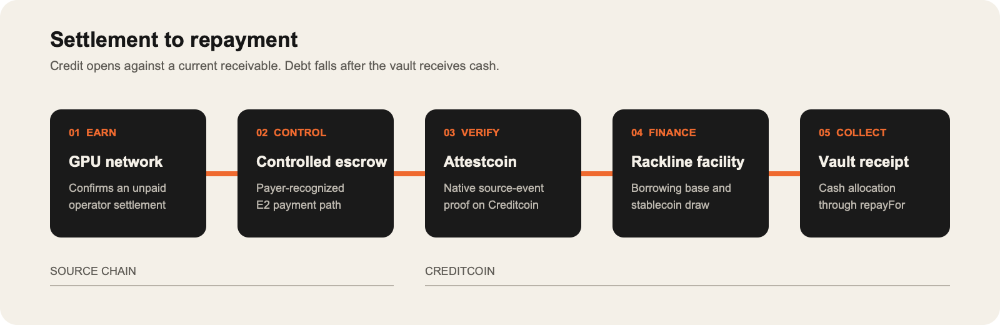

# Rackline

**Working capital for GPU operators, secured by confirmed receivables.**

Rackline finances revenue that GPU operators have earned but not yet received. A controlled source escrow records settlement events, Creditcoin verifies those events through the official Attestcoin native path, and the lending system turns eligible unpaid receivables into a borrowing base. Debt falls only after loan currency reaches the destination vault.

> Status (2026-09-17): hackathon prototype. The repository contains the full implementation, a browser demo, and a TEST_ONLY deployment on Creditcoin CC3 Testnet. The native technical path has been exercised with simulated source revenue, including a live QA of every product path — draws, repayments, freezes, delinquency and the non-payment path to write-off — against the deployed environment. This is not a production launch, a live lending pool, a partner integration, or proof of real GPU revenue.

[TEST_ONLY application](https://rackline.studioliq.com/app) · [Fixture demo](https://rackline.studioliq.com/demo) · [API health](https://api-rackline.studioliq.com/health) · [Indexer readiness](https://api-rackline.studioliq.com/ready)



## How it works

1. An operator and a provider account are reviewed and linked.
2. Confirmed unpaid receivables are assigned to a facility with payment control.
3. A source-chain event is proven with the official Attestcoin SDK and verified by Creditcoin's native BlockProver.
4. The evidence ledger consumes the verified event once.
5. The risk engine computes an eligible borrowing base and reserves exposure atomically for a draw.
6. Source cash moves through a settlement record to the destination vault.
7. Only measured destination cash allocated through `RepaymentRouter` reduces debt.

Five judgments stay separate: native event verification, GPU-revenue provenance, current unpaid status, payment-control strength, and destination cash receipt. Evidence for one never establishes another.

## What is in the repository

| Area | Contents |
| --- | --- |
| Smart contracts (`contracts/gpu/`) | Source escrow, native verifier, evidence and receivable books, role/control registries, debt ledger, risk and exposure controls, facility manager, lending vault, repayment router, settlement receiver, recovery manager, governance timelock |
| Attestcoin integration (`offchain/attestcoin/`) | Pinned `@gluwa/usc-sdk@0.18.0` and `@gluwa/asc-contracts@0.2.1`, hashed ABIs and sources, manifest validation, proof retrieval and submission encoding |
| Off-chain services (`offchain/gpu`, `offchain/api`, `offchain/prover`) | PostgreSQL migrations, ingestion, projections, reconciliation, durable jobs and outbox, transaction dispatch, proof worker, chain indexer, control monitor, wallet-authenticated FastAPI product API |
| Web application (`apps/web/`) | Borrower, LP, provider, activity, and operations views; wallet-signed deposit, withdrawal, draw, repayment, and test-faucet flows; isolated fixture demo at `/demo` |
| Verification | Foundry unit and invariant tests, Python service and migration tests, TypeScript conformance tests, generated ABI/OpenAPI parity checks, Playwright browser coverage, and an opt-in live scenario runner |

The committed [deployment manifest](config/gpu/deployments/cc3-testnet.json) records the TEST_ONLY contract suite deployed at block `5,484,231`. The [Attestcoin release manifest](config/attestcoin/cc3-testnet.sepolia.release.json) binds it to the TEST_ONLY Sepolia source escrow. The [native evidence record](evidence/native-testnet-2026-09-14.json) carries `nativeStatus=CONSUMED` for four source transitions plus a refreshed checkpoint, with [packaged official proof artifacts and SHA-256 checksums](config/gpu/evidence/native-20260914/index.json). It keeps `partnerRevenue=SIMULATED` and `partnerSourceBinding=UNCONFIGURED`.

## Testnet deployment

Creditcoin CC3 Testnet (`102031`), deployment block **5,484,231**. The loan token is a faucet token with no monetary value. Addresses and runtime code hashes are pinned in the [deployment manifest](config/gpu/deployments/cc3-testnet.json).

| Contract | Creditcoin CC3 Testnet address |
| --- | --- |
| ProtocolRoles | [0x421b075c3713339f57daf4c4564bc991cbeedb20](https://creditcoin-testnet.blockscout.com/address/0x421b075c3713339f57daf4c4564bc991cbeedb20) |
| ProviderRegistry | [0x4837767785fec906bd1cca409d21461ad1f7f952](https://creditcoin-testnet.blockscout.com/address/0x4837767785fec906bd1cca409d21461ad1f7f952) |
| AuthorizationVerifier | [0x1d4ceb59077b127e23cc36afa04a12cc9dcbde6c](https://creditcoin-testnet.blockscout.com/address/0x1d4ceb59077b127e23cc36afa04a12cc9dcbde6c) |
| AccountRegistry | [0x8942aac90466841d2663ff5259841a0e5455665e](https://creditcoin-testnet.blockscout.com/address/0x8942aac90466841d2663ff5259841a0e5455665e) |
| AttestcoinRevenueVerifier | [0x96fdb10d5247e5827c60ab5ce42bed71eb6411ab](https://creditcoin-testnet.blockscout.com/address/0x96fdb10d5247e5827c60ab5ce42bed71eb6411ab) |
| EvidenceBook | [0x1a5c5b66df9a125d778302dcec1483d597cd7207](https://creditcoin-testnet.blockscout.com/address/0x1a5c5b66df9a125d778302dcec1483d597cd7207) |
| ReceivableBook | [0xd22acb2e404d79a96d8e6bf815a8b3fd786d0d4d](https://creditcoin-testnet.blockscout.com/address/0xd22acb2e404d79a96d8e6bf815a8b3fd786d0d4d) |
| ControlRegistry | [0x2328e94f07e75a665e8c64bce7b917aa543866b9](https://creditcoin-testnet.blockscout.com/address/0x2328e94f07e75a665e8c64bce7b917aa543866b9) |
| DebtLedger | [0xe045da25b405f994802d7b5a32ed4331a3db1ecb](https://creditcoin-testnet.blockscout.com/address/0xe045da25b405f994802d7b5a32ed4331a3db1ecb) |
| GpuRiskPolicy | [0x0937cd639d744daeb21cdce22f97ebaea0850fde](https://creditcoin-testnet.blockscout.com/address/0x0937cd639d744daeb21cdce22f97ebaea0850fde) |
| ExposureController | [0xc312b9a9690b1c9dd95d409cb9a70628efcd41d8](https://creditcoin-testnet.blockscout.com/address/0xc312b9a9690b1c9dd95d409cb9a70628efcd41d8) |
| CreditFacilityManager | [0xa5a6c3237d424de0aaa00ed5859fcd7d6011226d](https://creditcoin-testnet.blockscout.com/address/0xa5a6c3237d424de0aaa00ed5859fcd7d6011226d) |
| LendingVaultV2 | [0x864f7ca37a640766d6e0a662c0a356d9b5813e75](https://creditcoin-testnet.blockscout.com/address/0x864f7ca37a640766d6e0a662c0a356d9b5813e75) |
| RepaymentRouter | [0xd4dcecfbb505a428e3c99363c23e58bfdb37949b](https://creditcoin-testnet.blockscout.com/address/0xd4dcecfbb505a428e3c99363c23e58bfdb37949b) |
| RecoveryManager | [0xb9cc16695203d1a63ebba0010cb8d46defa62489](https://creditcoin-testnet.blockscout.com/address/0xb9cc16695203d1a63ebba0010cb8d46defa62489) |
| SettlementReceiver | [0xcf5d03ecb4298577018c7162c62d97697f775ad8](https://creditcoin-testnet.blockscout.com/address/0xcf5d03ecb4298577018c7162c62d97697f775ad8) |
| GovernanceTimelock | [0xb067226e4afff044e6294888c61d2bad11a7c9b8](https://creditcoin-testnet.blockscout.com/address/0xb067226e4afff044e6294888c61d2bad11a7c9b8) |
| TreasuryTimelock | [0xe6e2c5a7c6c5066ad7d3f593ab2cc6f8810eea26](https://creditcoin-testnet.blockscout.com/address/0xe6e2c5a7c6c5066ad7d3f593ab2cc6f8810eea26) |
| GpuTestToken (tUSD, 6 decimals) | [0x03115387f28660088faa6a9b00aa21cc2ad1ade5](https://creditcoin-testnet.blockscout.com/address/0x03115387f28660088faa6a9b00aa21cc2ad1ade5) |

Source contracts on **Ethereum Sepolia (`11155111`)**:

| Contract | Sepolia address |
| --- | --- |
| SourceEscrow | [0x9e00a3a453704e6948689eb68a4f65649af30a97](https://sepolia.etherscan.io/address/0x9e00a3a453704e6948689eb68a4f65649af30a97) |
| Source GpuTestToken | [0x43d76b878f6b154e1ac351daad354767fad769eb](https://sepolia.etherscan.io/address/0x43d76b878f6b154e1ac351daad354767fad769eb) |

Source and destination tokens are different assets; a source payout never repays destination debt by itself. Governance uses a **60-second testnet timelock with an EOA governor**, not a production multisig. Deployment alone is not native-proof evidence.

## Native testnet evidence

Four Sepolia transactions were proven through the official Attestcoin path and consumed by the Rackline contracts on Creditcoin CC3 Testnet:

| Event | Source transaction | Creditcoin consumption |
| --- | --- | --- |
| Obligation recognized | [Sepolia receipt](https://sepolia.etherscan.io/tx/0x629bc722e9c893c3ce0982398d7322b8aa63c27f85ae0ea2ac9ff8853e503d90) | [block 5,484,320](https://creditcoin-testnet.blockscout.com/tx/0x704358f1f1e1a0495c42d52504a6676e0fbc00782a74e5b8e5a5f9d8f02d6f10) |
| Obligation assigned | [Sepolia receipt](https://sepolia.etherscan.io/tx/0x5294eb9ba7a9bdeda76e2ca958871ce9bad8ccf2b88cf777e962d9d8becb13c2) | [block 5,484,358](https://creditcoin-testnet.blockscout.com/tx/0x22f1d0342c3b972daec1b4c449f1dabc517187e71d41299f7f9aa1f82c86a496) |
| Payout received | [Sepolia receipt](https://sepolia.etherscan.io/tx/0x1b6811812773c2cd9f5a842ecaa8c1ab36bff4304e5c27334ea1ec425609952c) | [block 5,484,364](https://creditcoin-testnet.blockscout.com/tx/0x7d2a24a3d54a5a53826079af333f7c2369b95865d1ec69f8024fa5ecb1d4aae2) |
| Protected checkpoint | [Sepolia receipt](https://sepolia.etherscan.io/tx/0x1819a0b1ac28b351bb5edc710b38e4316246fac6978fa5af160929a1cd7c66fa) | [block 5,484,370](https://creditcoin-testnet.blockscout.com/tx/0xb810b3dbad479c59b62f3bfcf25ae6091444d7ebda362eb83398cd02acc794b0) |

Each proof-only transaction produced zero debt mutation events, zero vault mutation events, and zero vault-token transfer delta: verified source evidence changes evidence and receivable state, never destination debt or cash. The checkpoint had expired by the audit snapshot, so eligible unpaid collateral evaluated to zero, as intended.

Browser-driven financial flows on the same deployment, using faucet test tokens:

- [LP browser audit](evidence/native-testnet/lp-browser-20260914.json): nine transactions (faucet, approval, deposit, queue, cancel, re-queue, process, claim, final withdrawal). Final LP shares are zero; desktop and mobile views agree with the chain.
- [Borrower browser audit](evidence/native-testnet/borrower-browser-20260914.json), enabled by a [fresh native checkpoint](https://creditcoin-testnet.blockscout.com/tx/0x39dadbd7f24581069d40d5dee2d9f8148191c61ad95affbdd68c7bee0c77bba6): [borrow 1 tUSD](https://creditcoin-testnet.blockscout.com/tx/0x7f70742f267233e7195edec63635cc71bd80167f9e896f1f225f21f485c403ee), then [repay 1.000002 tUSD](https://creditcoin-testnet.blockscout.com/tx/0xa369810d67bb59695e7acc87d4163d1a1257876d6fba28635ee154dd1bc2fe78). The 1.001 tUSD cap transferred only principal plus execution-time interest. Legal debt is zero on-chain and in both views. Repayment succeeded after source protection had expired.
- [Live scenario suite](evidence/native-testnet/scenarios-20260914.json): 25 persona scenarios (visitor, unknown wallet, LP, borrower, keeper, misuse) passed against the deployed environment. Catalog: [docs/gpu/scenarios/live-user-scenarios.md](docs/gpu/scenarios/live-user-scenarios.md).

### Live QA with simulated network payers (2026-09-14 → 2026-09-17)

Two payer personas were deployed as `MockDePINPayout` contracts registered as PAYER on the TEST_ONLY Sepolia escrow — `SIM-AETHIR` (one reward obligation per epoch, paid in full after the epoch closes, QoS adjustments as signed corrections) and `SIM-GPUNET` (one invoice per job, streamed partial settlements, a chargeback, a dispute that cancels an invoice, an invoice overdue before financing). They imitate settlement behaviour only; they are not partner integrations.

- Thirty source transitions of every escrow event kind (recognition, assignment, correction, payout, payout cancellation, checkpoint) were proven through the official Attestcoin path and consumed on Creditcoin; every consumption was audited proof-only, and afterwards the destination ledger matched the source escrow exactly (revision, open and paid totals). A replay of a consumed log is refused by the tool and reverts on chain.
- The borrowing base followed the receivables: a paid epoch dropped out, a corrected epoch counted at its reduced amount, a charged-back settlement reopened the unpaid balance, an overdue invoice was haircut 10 %, a cancelled invoice was excluded; the eligible amount, the 50 % advance and the API's `availableDraw` agreed to the unit on every facility.
- On five facilities opened for the run: draws inside the checkpoint window, an over-limit draw refused, guardian freeze and underwriter resume, partial repayment with interest accrued at the contract rate, third-party `repayFor`, an installment schedule that went delinquent and was cured, full repayment to `REPAID`, and the non-payment path — `DELINQUENT` → approved default → `DEFAULTED` with accrual frozen → `RECOVERY` with a pledged reserve applied through the router → impairment lowering LP NAV by exactly the impaired amount → treasury write-off to `CLOSED_WITH_LOSS`, the legal debt still on the ledger.
- 60 scenarios executed against the deployed app, API and both chains (23 user, 23 payer-persona and credit, 7 non-payment drill on each of two facilities), plus browser checks of every non-performing state; all pass. Two fixes the run surfaced are in `main`: the API's receivable and repayment history is projected from finalized chain events (migration `0006`) instead of manual imports, and the app explains each non-performing state. About 180 real transactions, faucet tokens only.
- Catalog: [docs/gpu/scenarios/live-payer-scenarios.md](docs/gpu/scenarios/live-payer-scenarios.md). Evidence with every check and transaction hash: [evidence/native-testnet/qa-20260915/](evidence/native-testnet/qa-20260915/). Persona registry: [config/gpu/scenarios/payer-personas.json](config/gpu/scenarios/payer-personas.json).

## Architecture

```text
Sepolia / supported source chain
  SourceEscrow -> settlement event
                      |
                      v
Official Attestcoin proof service + SDK
                      |
                      v
Creditcoin native BlockProver -> AttestcoinRevenueVerifier
                      |
                      v
EvidenceBook -> ReceivableBook -> risk/exposure -> CreditFacilityManager
                                                     |
LPs -> LendingVaultV2 <------------------------------+
          ^
          |
SettlementReceiver -> RepaymentRouter -> DebtLedger
```

The browser never receives a keeper key. Financial transactions are signed in the connected wallet; the API serves deployment-bound reads, authenticated projections, review requests, and idempotent operational commands. Design details: [TECH.md](TECH.md).

## Run the demo

The demo uses browser-only fixtures and makes no wallet, API, RPC, or proof-service calls.

```bash
npm ci --prefix apps/web
npm --prefix apps/web run dev
```

Open `http://localhost:5173/demo`. The connected application at `/app` requires a configured GPU API; see [apps/web/README.md](apps/web/README.md) and [offchain/api/README.md](offchain/api/README.md).

## Validate the repository

Prerequisites: Foundry, Node.js 22.12+ (CI uses 24), Python 3.11+, PostgreSQL 16 for the database suite.

```bash
# Solidity
forge build --sizes
forge test
forge fmt --check

# Attestcoin tooling
npm ci --prefix offchain/attestcoin
npm --prefix offchain/attestcoin run check
npm --prefix offchain/attestcoin run test -- --run

# Web
npm ci --prefix apps/web
npm --prefix apps/web run lint
npm --prefix apps/web run build
npm --prefix apps/web run test:unit
npm --prefix apps/web run test:e2e

# Python
python -m pip install -e "offchain/gpu[dev]" -e "offchain/api[dev]" -e "offchain/prover[dev]"
(cd offchain/gpu && python -m pytest tests -q)
(cd offchain/api && python -m pytest tests -q)
(cd offchain/prover && python -m pytest tests -q)
```

The Python migration tests use `HASHCREDIT_GPU_TEST_DATABASE_URL` when set, or start an ephemeral local PostgreSQL cluster when `initdb`/`pg_ctl` are installed. CI runs the same suites plus Slither with a reviewed triage file (`.github/workflows/test.yml`).

## Repository map

```text
contracts/gpu/       Rackline v2 contracts (vendored official Attestcoin sources under vendor/)
test/gpu/            Foundry unit, invariant, and conformance tests
offchain/gpu/        shared domain, database, ingestion, reconciliation, worker runtime
offchain/attestcoin/ pinned official SDK artifacts and proof tooling
offchain/api/        GPU product API (legacy Bitcoin API modules isolated)
offchain/prover/     GPU workers (legacy SPV modules isolated)
apps/web/            connected application and fixture-only demo
config/              domain schemas, Attestcoin manifests, deployment manifest, packaged proofs
evidence/            curated public testnet evidence
script/gpu/          deployment, facility setup, ABI export, native-proof and evidence tools
```

The original Bitcoin-SPV prototype remains in the repository as legacy code and is not an evidence path for Rackline v2. A [pinned read-only inventory](evidence/legacy/102031-5484137.json) preserves its open TEST_ONLY positions without mixing them into v2 claims. Package, CLI, and environment identifiers (`hashcredit_*`, `HASHCREDIT_*`) keep the legacy name.

## Documentation

Design

- [Technical design](TECH.md)
- [Domain model, identifiers, and API contract](docs/gpu/domain-model.md)
- [Accounting model](docs/gpu/accounting.md)
- [Permissions, control agreements, and state transitions](docs/gpu/permissions-and-states.md)
- [Evidence and settlement reconciliation](docs/gpu/evidence-and-reconciliation.md)

Attestcoin

- [Environment and artifact pins](docs/gpu/attestcoin/environment.md)
- [Native evidence contract](docs/gpu/attestcoin/evidence-contract.md)
- [Proof-to-business mapping](docs/gpu/attestcoin/proof-to-business-mapping.md)
- [Vendored official sources](contracts/gpu/vendor/attestcoin/VENDORED.md)

Components and operations

- [GPU API](offchain/api/README.md)
- [Shared GPU package and database](offchain/gpu/README.md)
- [Worker runtime](offchain/gpu/RUNTIME.md) and [workers](offchain/prover/README.md)
- [Attestcoin tooling](offchain/attestcoin/README.md)
- [Web application](apps/web/README.md) and [browser verification](apps/web/tests/README.md)
- [Live user scenarios](docs/gpu/scenarios/live-user-scenarios.md)
- [Live payer-persona and credit-operation scenarios](docs/gpu/scenarios/live-payer-scenarios.md)

## License

MIT
